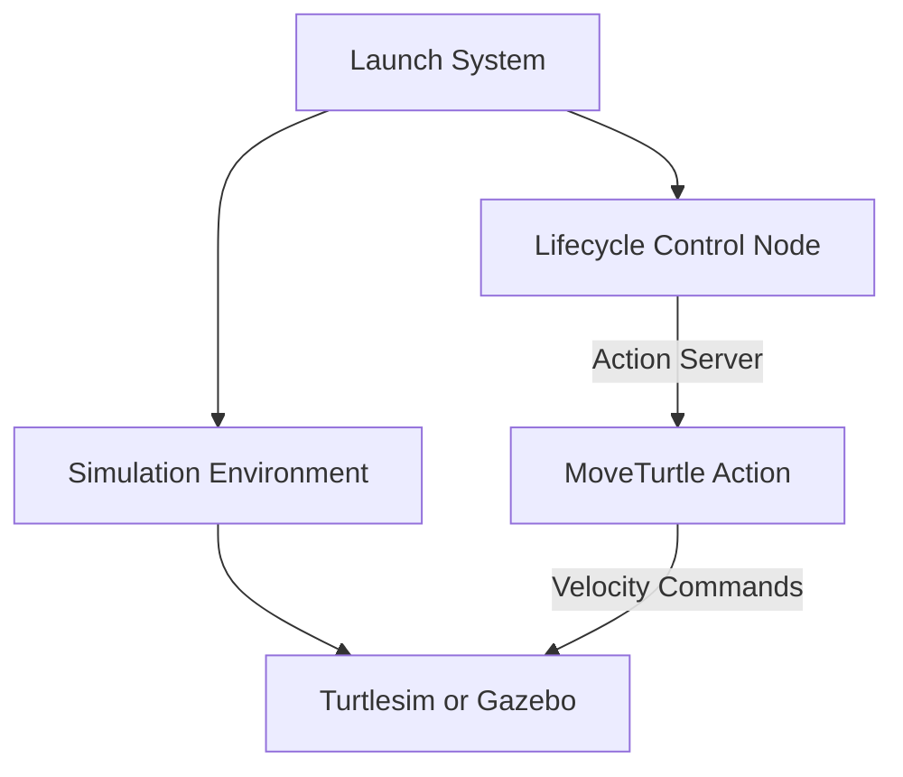
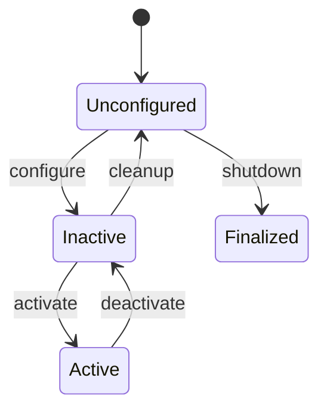
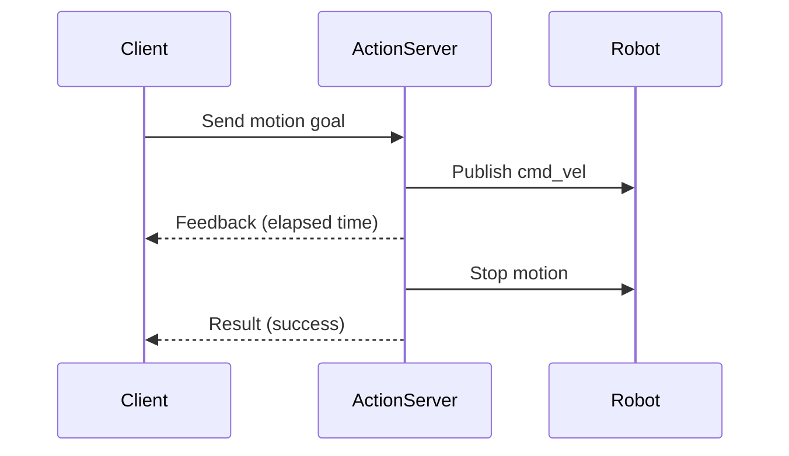

# Turtlesim and Turtlebot3 - Advanced ROS2 Concepts Applied


---

## Overview

This repository presents a ROS 2 (Humble) project that applies **advanced ROS 2 concepts** to two different execution contexts:

- **Turtlesim**, used as a lightweight and didactic environment
- **TurtleBot3**, used in a realistic mobile robot simulation with Gazebo

Both contexts share the **same architectural principles**, allowing a direct comparison between a simplified simulator and a full robotic platform.

The project focuses on demonstrating:

- Explicit lifecycle management using Lifecycle Nodes
- Asynchronous command execution using ROS 2 Actions
- Clear separation between interfaces and implementation
- Modular and reusable package organization
- Reproducible and extensible launch configuration

---

## Execution Contexts

### Turtlesim Context

The Turtlesim environment is used as an entry-level scenario to validate:

- Lifecycle transitions
- Action server and client interaction
- Deterministic motion execution
- Feedback and result handling

Despite its simplicity, Turtlesim allows the full ROS 2 control architecture to be exercised without the overhead of a full simulation.

---

### TurtleBot3 Context

The TurtleBot3 context extends the same architecture to a realistic mobile robot simulation using Gazebo.

In this scenario, the system controls a TurtleBot3 model by:

- Launching Gazebo server and client
- Spawning the TurtleBot3 robot
- Sending velocity commands via an Action interface
- Managing node execution through Lifecycle states

This context demonstrates how the same control logic can be reused in a more complex and realistic robotic setup.

---

## High-Level Architecture



---

## Lifecycle Node Design

The control node follows the ROS 2 Lifecycle model, ensuring safe and deterministic behavior.



The control architecture is implemented using **ROS 2 Lifecycle Nodes**, allowing explicit control over node initialization, activation, execution, and shutdown.
This design is applied consistently in both execution contexts — **Turtlesim** and **TurtleBot3** — while adapting the internal behavior to each environment.

Below, each lifecycle callback is described in detail.


### `on_configure()`

The `on_configure()` callback is responsible for **initializing the logical state of the system**, without yet enabling motion commands.

#### Turtlesim context

In the Turtlesim implementation, this callback performs environment preparation tasks:

- A new turtle is spawned at a random position in the simulator.
- The default turtle (`turtle1`) is removed to avoid conflicts.
- Service clients for `/spawn` and `/kill` are created and used asynchronously.
- No publishers or action servers are activated at this stage.

This ensures that the simulation environment is properly prepared before any motion command is allowed.

#### TurtleBot3 context

In the TurtleBot3 implementation, `on_configure()` is intentionally lightweight:

- No motion-related resources are created.
- The node verifies that the system is ready to transition to an operational state.
- The robot is assumed to be already spawned by the launch system.

This reflects real robotic systems, where hardware and simulation resources are typically initialized externally.

---

### `on_activate()`

The `on_activate()` callback marks the transition to the **operational state** of the node.
This is the point where motion control becomes available.

In both contexts, the following actions are performed:

- A publisher for `geometry_msgs::msg::Twist` is created.
- A ROS 2 Action Server (`MoveTurtle`) is instantiated.
- The node becomes capable of receiving and executing motion goals.

#### Turtlesim context

- The velocity publisher is created on `<turtle_name>/cmd_vel`.
- The action server namespace is dynamically generated based on the turtle name.
- Motion commands directly affect the spawned turtle in the simulator.

#### TurtleBot3 context

- The velocity publisher targets the global `/cmd_vel` topic.
- The action server controls the mobile robot base in Gazebo.
- This mirrors the control interface of a real TurtleBot3 robot.

Using `on_activate()` ensures that motion commands are only accepted when the system is fully ready.

---

### `on_deactivate()`

The `on_deactivate()` callback safely transitions the node out of the operational state.

In both contexts:

- The Action Server is destroyed.
- No new goals can be accepted.
- Motion command capability is disabled.

This prevents unintended robot motion while the node is inactive and allows safe reconfiguration or shutdown.

---

### `on_cleanup()`

The `on_cleanup()` callback is used to **release resources and revert environment changes** made during configuration.

#### Turtlesim context

- The dynamically spawned turtle is removed using the `/kill` service.
- Internal state related to the turtle instance is cleared.

This ensures that the simulator returns to a clean state.

#### TurtleBot3 context

- No physical or simulated entities are removed.
- The callback mainly serves to reset internal logic and prepare for a new configuration cycle.

This difference reflects the distinction between a didactic simulator and a persistent robotic platform.

---

### `on_shutdown()`

The `on_shutdown()` callback is invoked when the node is transitioning to the final state.

In both contexts:

- Final cleanup actions are performed.
- Informational logs are emitted.
- No new resources are created or destroyed beyond this point.

This callback guarantees a graceful and deterministic shutdown of the control node.

---

### Lifecycle Design Rationale

Using lifecycle callbacks provides the following advantages:

- Clear separation between initialization, execution, and cleanup phases
- Prevention of motion commands before system readiness
- Deterministic behavior during startup and shutdown
- Safe reuse of the same architecture across different execution environments

The same lifecycle-based design scales seamlessly from **Turtlesim** to **TurtleBot3**, demonstrating the portability and robustness of the approach.

---

## Action-Based Motion Control

Motion commands are implemented using a custom ROS 2 Action, enabling:

- Time-based motion execution
- Continuous feedback during execution
- Explicit success or failure results
- Support for cancellation

### Action Execution Flow



---

## Visual Demonstration

The following animation illustrates the TurtleBot3 executing a motion command using the described architecture.


---

## Build Instructions

```bash
cd ~/ros2_ws/src
git clone https://github.com/Eduard0Castro/move_turtle.git
cd ~/ros2_ws
colcon build
source install/setup.bash
```

---

## Running the System

### Turtlesim

```bash
ros2 launch move_turtle_final turtle_final.launch.xml
```

### TurtleBot3

```bash
ros2 launch move_turtle_final turtle_bot_final.launch.xml
```

---

## Sending an Action Goal

```bash
ros2 action send_goal /move_turtle_bot move_turtle_interfaces/action/MoveTurtle '{linear_vel_x: 1.0, angular_vel_z: 1.5, duration_sec: 10}' --feedback 
```

---

## Requirements

- Ubuntu 22.04
- ROS 2 Humble Hawksbill
- C++11 compatible compiler
- turtlesim
- TurtleBot3 packages
- Gazebo Classic
- colcon

---

## Repository Structure

```text
move_turtle/
├── move_turtle_final/
│   ├── include/
│   │   └── move_turtle_final/
│   │       └── turtle_control.hpp
│   ├── launch/
│   │   ├── turtle_final.launch.xml
│   │   └── turtle_bot_final.launch.xml
│   ├── src/
│   │   ├── turtle_control.cpp
│   │   └── turtle_lifecycle_manager.cpp
│   ├── CMakeLists.txt
│   └── package.xml
│
├── move_turtle_interfaces/
│   ├── action/
│   │   └── MoveTurtle.action
│   ├── msg/
│   ├── CMakeLists.txt
│   └── package.xml
```

## References

- https://docs.ros.org
- https://docs.ros.org/en/humble/p/lifecycle/
- https://docs.ros.org/en/humble/Tutorials/Beginner-CLI-Tools/Understanding-ROS2-Actions/Understanding-ROS2-Actions.html
- https://docs.ros.org/en/foxy/Concepts/About-Composition.html
